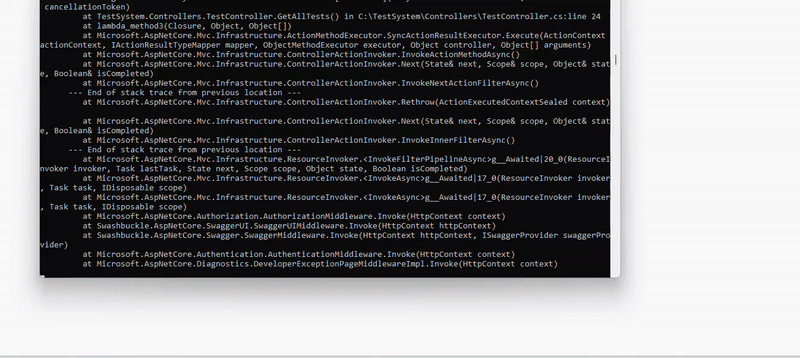
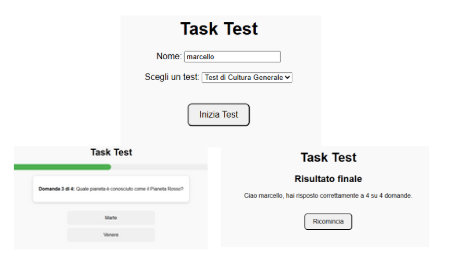
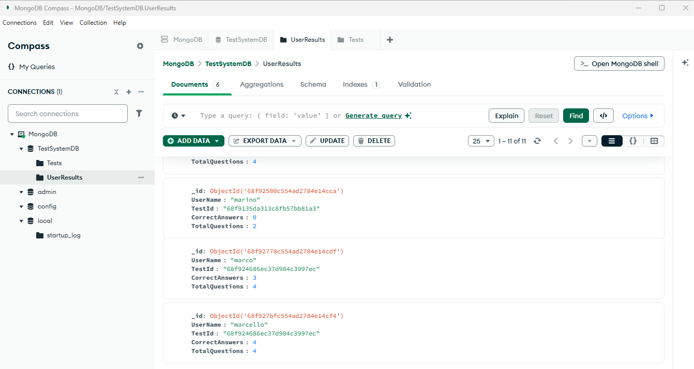

# Test System / C Sharp

Questa applicazione permette di eseguire test online. L’utente inserisce il proprio nome, sceglie un test, risponde alle domande e, al termine, visualizza il risultato. I risultati vengono salvati in MongoDB.

Il sistema è sviluppato con **C# .NET**, **MongoDB**, **HTML**, **CSS** e **JavaScript**.

---

## 🖼️ **Anteprima Applicazione**



- Homepage: inserimento nome e selezione test
- Test view: sequenza dinamica di domande con opzioni multiple
- Result view: visualizzazione dei risultati finali



---

## 📂 **Struttura del progetto**

TestSystem/
│
├─ Controllers/
│ ├─ TestController.cs # API per test (GET, POST)
│ └─ UserResultController.cs # API per risultati utente (GET, POST)
│
├─ Models/
│ ├─ Test.cs
│ └─ UserResult.cs
│
├─ Services/
│ └─ MongoDBService.cs # Servizio per connessione MongoDB e collezioni
│
├─ wwwroot/
│ └─ index.html # Frontend HTML/JS/CSS
│
├─ Program.cs / Startup.cs # Configurazione Web API
└─ appsettings.json # Connessione MongoDB

yaml

---

## 🛠️ **Prerequisiti**

- .NET 7 SDK+
- MongoDB (locale o Atlas)
- Browser moderno
- Node.js opzionale se vuoi usare strumenti frontend

---

## ⚙️ **Setup Backend**

1. Clona il repository:

```bash
git clone <REPO_URL>
cd TestSystem
Configura MongoDB in appsettings.json:

json
Copia codice
{
  "MongoDB": {
    "ConnectionString": "mongodb://localhost:27017",
    "DatabaseName": "TestSystemDB"
  }
}
Avvia l’API:

bash
Copia codice
dotnet run
Le API saranno disponibili su http://localhost:5155/api.

⚡ Setup Frontend
Il frontend è un semplice file HTML/JS:

Apri wwwroot/index.html nel browser.

Assicurati che l’API sia in esecuzione (http://localhost:5155/api).

Inserisci il nome, seleziona un test e avvia il test.

🚀 Funzionamento principale
Backend (MongoDBService + Controllers)

TestController: fornisce GET/POST per i test.

UserResultController: salva i risultati degli utenti.

MongoDB salva:

Collezione Tests: tutti i test disponibili.

Collezione UserResults: risultati degli utenti.

Frontend (HTML + JS)

Carica dinamicamente i test disponibili.

Mostra ogni domanda con le opzioni di risposta.

Aggiorna la barra di progresso in base alla domanda corrente.

Al termine, mostra il punteggio e salva il risultato via POST.

🛠️ Problemi risolti
Problema	Soluzione
Test non caricati dinamicamente	Fetch API per leggere tutti i test da MongoDB
Progress bar non aggiornata	Funzione JS calcola % basata su indice domanda / totale
Risultati non salvati	POST su /api/UserResult al termine del test
Selezione test vuota	Controllo JS: impedisce di avviare test senza selezione
Question con numero variabile di opzioni	Loop dinamico su array di opzioni

🧪 Testing
Avvia il backend: dotnet run

Apri index.html nel browser.

Verifica che i test siano caricati nella select.

Completa un test e verifica che il risultato venga salvato in MongoDB.

Controlla eventuali errori nella console del browser o nel terminal backend.

📌 Note
Ogni test può avere un numero variabile di domande e opzioni.

Il backend salva ogni risultato dell’utente per futuro riferimento.

Indici MongoDB consigliati su Test.Id e UserResult.TestId per performance.

È possibile estendere il progetto aggiungendo autenticazione o funzionalità admin per creare/modificare test.